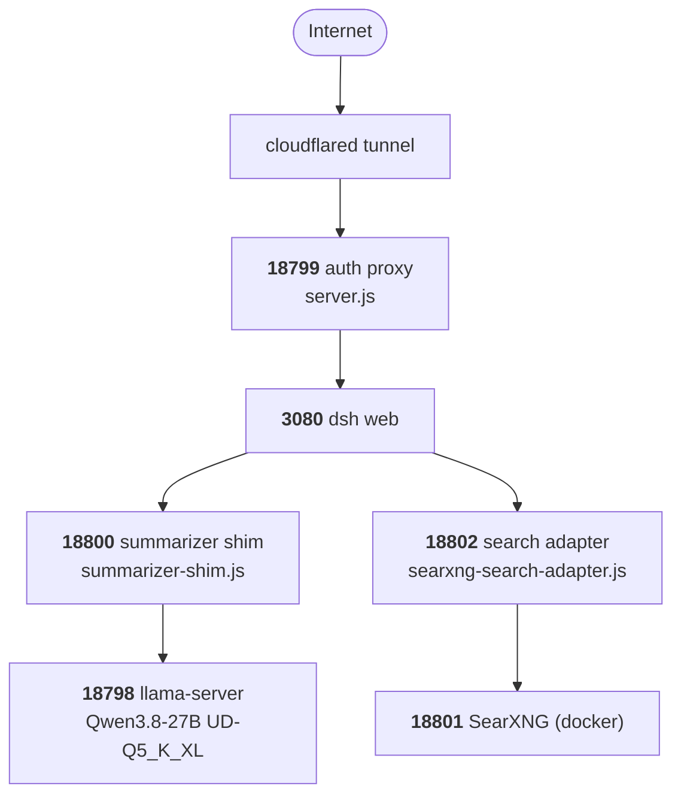

# seek-stack

Everything that makes **seek.joelcrobinson.com** work: a self-hosted [DeepSeek Harness](https://github.com/deepseek-ai/deepseek-harness) coding agent running **Qwen3.8-27B** entirely on a local RTX 3090, reachable from anywhere through a Cloudflare tunnel, with a hand-rolled auth layer in front of it and two small Node shims that fix things the harness gets wrong.

No API keys. No cloud inference. The model, the search index, and the filesystem are all local.

---

## Architecture



Every port binds `127.0.0.1`. The only thing reachable from outside is the tunnel, and it terminates at the auth proxy.

| Port | Process | Role |
|---|---|---|
| `18799` | `dsh/proxy/server.js` | HTTP Basic + cookie session, **the tunnel's only target** |
| `3080` | `dsh web` | The harness UI |
| `18800` | `dsh/proxy/summarizer-shim.js` | Rewrites the compaction call, forwards to `18798` |
| `18798` | `llama-server` | Qwen3.8-27B, 64K ctx, MTP speculative decoding |
| `18802` | `dsh/proxy/searxng-search-adapter.js` | Impersonates Anthropic's Messages API, forwards to `18801` |
| `18801` | SearXNG (docker) | Local search index, no API key |

---

## Layout

```
start-seek.ps1                          orchestrator - starts everything, idempotent
llama.cpp/serve-qwen38.ps1              llama-server launch flags
dsh/settings.yaml                       harness config: providers, context, reasoning
dsh/profiles/web/cordis.patch.yml       plugin-tree patch: remote-safe directory picker
dsh/proxy/server.js                     auth proxy (18799)
dsh/proxy/summarizer-shim.js            compaction fix (18800)
dsh/proxy/searxng-search-adapter.js     free web_search backend (18802)
searxng/                                docker-compose + settings for the search index
cloudflared/ingress-snippet.yml         tunnel ingress fragment
scheduled-task/register-seekharness.ps1 autostart at logon
```

Deployed paths on the host: `start-seek.ps1` to `~`, the `dsh/` tree to `~/.dsh/`, `llama.cpp/` to `A:\llama.cpp\`, `searxng/` to `~/searxng/`.

---

## Setup

**Prerequisites** — a 24 GB CUDA GPU, Node, Docker, `cloudflared`, llama.cpp with CUDA, and `npm i -g @deepseek-ai/dsh`. The model is `unsloth/Qwen3.8-27B-GGUF` at `UD-Q5_K_XL` (18.83 GB).

1. **Copy files to the paths above**, adjusting the absolute paths baked into `start-seek.ps1`, `serve-qwen38.ps1`, and the two `LOG =` constants in the proxy scripts.

2. **Set the proxy credentials** (User scope — the proxy refuses to start without them, rather than exposing the harness unauthenticated):

   ```powershell
   [Environment]::SetEnvironmentVariable('DSH_PROXY_USER','you','User')
   [Environment]::SetEnvironmentVariable('DSH_PROXY_PASS','a-long-random-string','User')
   ```

3. **Generate a SearXNG secret** — `searxng/settings.yml` ships a `CHANGEME` placeholder. Replace it with `openssl rand -hex 32`, then `docker compose up -d` in `searxng/`.

4. **Point the tunnel at 18799**, per `cloudflared/ingress-snippet.yml`.

5. **Register autostart**: `.\scheduled-task\register-seekharness.ps1`

6. **Start it**: `.\start-seek.ps1` — safe to re-run, it skips whatever is already healthy.

### Verifying

```bash
curl -s -o /dev/null -w "%{http_code}\n" https://seek.example.com/
```

**401 is success** — that is the auth proxy challenging you. **502 means the tunnel is up but the origin is down**: run `start-seek.ps1`. Logs land in `~/.dsh/autostart.log`, `~/.dsh/proxy/*.log`, and `A:\llama.cpp\qwen38-server.log.err`.

---

## Security model

The harness has **no authentication of its own**, and its Standard agent preset can run PowerShell. Exposing `3080` directly is internet-wide RCE. Everything rests on the tunnel terminating at `18799`.

The proxy (`server.js`) does two things that matter:

- **Basic auth mints a signed cookie.** Basic alone re-prompted every few minutes, because browsers do not attach cached Basic credentials to WebSocket handshakes — every `/api/events.mux` reconnect drew a `401 + WWW-Authenticate` and popped the login dialog. Now the first successful auth issues an HMAC-signed 30-day `dsh_auth` cookie, checked *before* Basic. The signing secret persists at `.dsh/proxy/.secret` (gitignored) so a restart does not sign everyone out.
- **Upgrades are never challenged.** A failed WebSocket handshake returns `401` with *no* `WWW-Authenticate`, so it cannot raise a browser prompt.

---

## Things that cost real time

Each of these is a fix that is not obvious from the outside, kept here so it does not have to be rediscovered.

**The port is not a liveness check.** `llama-server` binds `18798` immediately and serves `503 {"Loading model"}` until the weights are on the GPU — so a hung instance holds the port and looks healthy. Worse, on the first boot after a PC restart it has bound the port, read 36 MB of the GGUF, then stalled forever at 0 bytes/s with the GPU untouched — most likely the NVIDIA driver not being ready when the task fires a minute after logon. `start-seek.ps1` therefore health-checks rather than port-checks, and kills + retries once.

**MTP speculative decoding is mandatory.** Qwen3.8 ships nextn/MTP heads inside the GGUF. Without `--spec-type draft-mtp`, llama.cpp loads them, prints `unused tensor blk.*.nextn.* -- ignoring`, and leaves half the speed on the floor: **36.0 to 53.8 t/s (1.49x)** for +637 MB VRAM. `--spec-draft-n-max 2` is the 24 GB optimum; `3` was *worse* (44.9 t/s, acceptance collapsing 61.7% to 41.7%).

**`contextWindow` must be pinned.** llama-server advertises both `n_ctx` (65536, actually served) and `n_ctx_train` (262144). Without an explicit `contextWindow`, the harness believes the training figure, never compacts in time, and requests die on overflow.

**Reasoning needs a hard cap, not a request.** `reasoning_effort` is only a sentence injected into the prompt — it holds on easy turns and is ignored on hard ones. At `effort=low`, a trivial question used 215 completion tokens while "design a complete Catan implementation" used 22,747. `--reasoning-budget 4096` is the actual enforcement, and it works **only** as a server launch flag; as a per-request body field it is silently ignored.

**The compaction summarizer needed a shim.** dsh `0.1.0-rc.7` gives it a hard-coded 8192-token cap that may include reasoning tokens, and exposes no settings namespace to change it. Qwen3.8 spends the entire budget thinking, so the summary is truncated, compaction never shrinks the conversation, and every turn afterwards dies on max-tokens. The shim identifies that one call *by its 8192 cap* and disables thinking for it — the same prompt then returns a complete answer in 29 tokens. This is why `settings.yaml` points at `18800` and not `18798`, and why there is deliberately no `compaction-basic:` block in it.

**Search without an API key.** The harness ships one search provider that needs a paid `DEEPSEEK_API_KEY`; its alternatives are published on a stale version line. Rather than add a provider plugin, the adapter reuses the installed one and swaps where it points — impersonating Anthropic's Messages API and answering from local SearXNG. The provider is strict: the response must contain a `web_search_tool_result` block, and snippets are read from a *separate* `text` block's `citations[]`, not from the result items.

**The directory picker must be pinned to `-browse`.** The default `-auto` row samples the host once at boot; this machine has a display, so it mounts `-native` — an OS dialog on the host's desktop — and `/api/host.pickDirectory` returns `403` over the tunnel. An id-targeted patch cannot swap `name` (it is asserted, not assigned), so the patch disables the auto row and inserts the browse row. **Both faces** must be composed by hand: compose only the host row and you get the capability with no UI, and `ui-workspace` silently *hides* directory picking rather than erroring.

**PowerShell argument quoting.** `Start-Process -ArgumentList` joins its array with spaces and does not quote elements, so `--reasoning-budget-message` needed embedded quotes — without them llama-server read `Reasoning` as the message and died with `invalid argument: budget`.

---

## Not in this repo

The harness itself (`npm i -g @deepseek-ai/dsh`), the GGUF weights, `~/.dsh/sessions` and `~/.dsh/storages` (conversation state), and every secret: `.dsh/proxy/.secret`, the `DSH_PROXY_*` env vars, the real SearXNG `secret_key`, and the cloudflared tunnel credentials.
