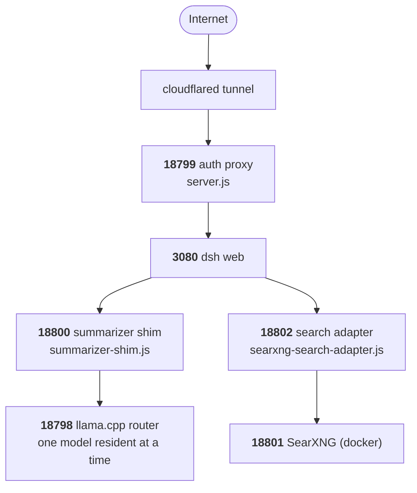

# seek-stack

A coding agent that runs **entirely on your own machine**. The model runs on your GPU, web search runs in a local container, and your code never leaves your computer. No API keys, no cloud inference, no monthly bill.

Built on the [DeepSeek Harness](https://github.com/deepseek-ai/deepseek-harness) with **Qwen3.8-27B** on llama.cpp, plus a local SearXNG index and two small Node shims that fix things the harness gets wrong. Optionally reachable from anywhere through a Cloudflare tunnel, behind an auth proxy.

## Install

**1.** Download this repo — green **Code** button → **Download ZIP** — and extract it.

**2.** Open the extracted folder and **double-click `install.cmd`**.

That is the whole thing. It reads your GPU, picks a model size that fits, installs
what is missing, downloads everything, and starts it. Re-run it if it stops
partway — every step resumes.

<details>
<summary>Prefer the terminal?</summary>

`cd` into the folder first, or the relative path will not resolve. Note that the
ZIP extracts to **`seek-stack-main`**, not `seek-stack`:

```powershell
cd $HOME\Downloads\seek-stack-main
powershell -ExecutionPolicy Bypass -File .\install.ps1
```

If you would rather not care where you are, give it the full path:

```powershell
powershell -ExecutionPolicy Bypass -File "$HOME\Downloads\seek-stack-main\install.ps1"
```
</details>

Then open **http://127.0.0.1:3080**.

You need an NVIDIA GPU with **10 GB of VRAM or more** and ~25 GB of free disk.
Node, Docker and llama.cpp are installed for you if missing.

## Work app

The installer also deploys Seek Work and its browser viewer. Open
**http://127.0.0.1:3080/work** for conversations, background tasks, the animated
character, browser handoff, files, finance, and connected apps. The Images tab
offers a separate one-time setup for the optional local Qwen Image runner.

See the [Seek Work wiki](https://github.com/thejoelrobinson/seek-stack/wiki)
for features and how-to guides. [Work mode](dsh/plugins/browser-viewer/WORK-MODE.md)
and [browser control](dsh/plugins/browser-viewer/README.md) have implementation
notes. To update just the Work plugins on an existing harness, run the
browser-viewer install.ps1 script and restart the web harness.

## Documentation

| | |
|---|---|
| **[docs/SETUP.md](docs/SETUP.md)** | Full walkthrough, from a fresh PC to a working agent — start here |
| **[docs/TROUBLESHOOTING.md](docs/TROUBLESHOOTING.md)** | Symptoms and fixes when something misbehaves |
| **[docs/HARDWARE.md](docs/HARDWARE.md)** | What fits on your card, and how to run a different model |

Everything below is how it works internally — useful for modifying it, not needed
to run it.

---

## Architecture


```mermaid
flowchart TD
    net([Internet]) --> cf[cloudflared tunnel]
    cf --> proxy["<b>18799</b> auth proxy<br/>server.js"]
    proxy --> web["<b>3080</b> dsh web"]
    web --> shim["<b>18800</b> summarizer shim<br/>summarizer-shim.js"]
    shim --> llama["<b>18798</b> llama.cpp router<br/>one model resident at a time"]
    web --> adapter["<b>18802</b> search adapter<br/>searxng-search-adapter.js"]
    adapter --> searx["<b>18801</b> SearXNG (docker)"]
```

Every port binds `127.0.0.1`. The only thing reachable from outside is the tunnel, and it terminates at the auth proxy.

| Port | Process | Role |
|---|---|---|
| `18799` | `dsh/proxy/server.js` | form sign-in + cookie session, **the tunnel's only target** |
| `3080` | `dsh web` | The harness UI |
| `18800` | `dsh/proxy/summarizer-shim.js` | Rewrites the compaction call, forwards to `18798` |
| `18798` | `llama-server` (router) | Serves every model in `models.ini`, keeps **one** resident (`--models-max 1`) so it gets the whole GPU |
| `18802` | `dsh/proxy/searxng-search-adapter.js` | Impersonates Anthropic's Messages API, forwards to `18801` |
| `18801` | SearXNG (docker) | Local search index, no API key |

---

## Layout

```
install.ps1                             one-shot installer
uninstall.ps1                           removes it again
seek.config.example.ps1                 every path, port and limit in one place
start-seek.ps1                          orchestrator - starts everything, idempotent
llama.cpp/serve-router.ps1              generates models.ini, starts the router
dsh/settings.yaml                       harness config: providers, context, reasoning
dsh/profiles/web/cordis.patch.yml       plugin-tree patch: remote-safe directory picker
dsh/proxy/server.js                     auth proxy (18799)
dsh/proxy/summarizer-shim.js            compaction fix (18800)
dsh/proxy/searxng-search-adapter.js     free web_search backend (18802)
searxng/                                docker-compose + settings for the search index
cloudflared/ingress-snippet.yml         tunnel ingress fragment
scheduled-task/register-seekharness.ps1 autostart at logon
docs/                                   setup, troubleshooting, hardware
```

The installer deploys the `dsh/` tree to `~/.dsh/`, `llama.cpp/` and the model to
your chosen `-InstallDir`, and `searxng/` to `~/searxng/`. **No path is hardcoded**
— everything reads `~/.dsh/seek.config.ps1`, which the installer generates.

### Configuration

One file: `~/.dsh/seek.config.ps1`, documented in
[`seek.config.example.ps1`](seek.config.example.ps1). Both PowerShell scripts
dot-source it, and the Node services log beside themselves rather than to any
fixed location.

Two values must stay in sync, and nothing enforces it: `$ContextSize` there and
`contextWindow:` in `~/.dsh/settings.yaml`. The installer sets both; if you change
one by hand, change the other.

### Verifying

```powershell
curl.exe -s -o NUL -w "%{http_code}\n" http://127.0.0.1:3080        # the UI
curl.exe -s -o NUL -w "%{http_code}\n" http://127.0.0.1:18798/health # the model
```

Through a tunnel, unauthenticated pages redirect to the sign-in form (HTTP 303); API requests return 401.
**502 means the tunnel is up but the origin is down**: run `start-seek.ps1`. The
last line of `~/.dsh/autostart.log` summarises every service.

---

## Security model

The harness has **no authentication of its own**, and its Standard agent preset can run PowerShell. Exposing `3080` directly is internet-wide RCE. Everything rests on the tunnel terminating at `18799`.

The proxy (`server.js`) does two things that matter:

- **Sign-in mints a signed cookie.** The proxy validates the owner or partner login, then issues a 30-day HMAC-signed dsh_auth cookie. The signing secret persists under the local DSH proxy directory, so a restart does not sign everyone out. Login uses a CSRF token and rate limits attempts.
- **Upgrades are never challenged.** A failed WebSocket handshake returns `401` with *no* `WWW-Authenticate`, so it cannot raise a browser prompt.

---

## Things that cost real time

Each of these is a fix that is not obvious from the outside, kept here so it does not have to be rediscovered.

**The port is not a liveness check.** In router mode `18798` answers `/health` **200 as soon as it binds**, before any weights load, so health alone proves nothing either — `start-seek.ps1` gates on a warmup completion instead. (Before router mode it bound the port and served `503 {"Loading model"}` until the weights were on the GPU — so a hung instance held the port and looked healthy.) Worse, on the first boot after a PC restart it has bound the port, read 36 MB of the GGUF, then stalled forever at 0 bytes/s with the GPU untouched — most likely the NVIDIA driver not being ready when the task fires a minute after logon. `start-seek.ps1` therefore gates on a real warmup completion rather than a port or health check, and kills + retries once.

**MTP speculative decoding is mandatory.** Qwen3.8 ships nextn/MTP heads inside the GGUF. Without `--spec-type draft-mtp`, llama.cpp loads them, prints `unused tensor blk.*.nextn.* -- ignoring`, and leaves half the speed on the floor: **36.0 to 53.8 t/s (1.49x)** for +637 MB VRAM. `--spec-draft-n-max 2` is the 24 GB optimum; `3` was *worse* (44.9 t/s, acceptance collapsing 61.7% to 41.7%).

**`contextWindow` must be pinned.** llama-server advertises both `n_ctx` (65536, actually served) and `n_ctx_train` (262144). Without an explicit `contextWindow`, the harness believes the training figure, never compacts in time, and requests die on overflow.

**Reasoning needs a hard cap, not a request.** `reasoning_effort` is only a sentence injected into the prompt — it holds on easy turns and is ignored on hard ones, which are exactly the turns that were dying. At `effort=low`, a trivial question used 215 completion tokens while "design a complete Catan implementation" used 22,747 (20,233 chars of reasoning); agent steps were still emitting ~18,900 reasoning tokens with `tools=[]` — pure deliberation, no action, turn dead on max-tokens. **Do not judge an effort setting by a short prompt**: it will look like a 10x win and deliver nothing on real work.

`--reasoning-budget N` is the actual enforcement. `-1` unrestricted (the default), `0` no thinking, `N>0` a hard cap; env equivalent `LLAMA_ARG_THINK_BUDGET`. It works **only** as a server launch flag — as a per-request body field it is silently ignored (two runs with and without came back byte-identical).

**Once the budget binds, effort stops controlling reasoning length.** With `--reasoning-budget 4096`, the same hard prompt produced 10,712 chars of reasoning at `effort=low` and 10,659 at `effort=xhigh` — within 0.5% of each other, despite those levels differing ~10x unbudgeted. Both finished `stop`, no truncation. Effort still affects *answer* length (62,849 vs 34,684 chars), just not thinking.

Confirmed in the real agent path, not only synthetic prompts: a headless contract-review task ran at 4,237 max output tokens/step with 0 compactions and the turn completing, against the two preceding unbudgeted sessions at 24,576 and 19,349 max out, 5 max-tokens deaths, 17 compactions. 4,237 is roughly the 4,096 cap plus the tool call, so the cap binds in agent turns too. Caveat: n=1, 4 steps, deliberately narrow read-only task — this does not isolate the budget from good task scoping. Answer quality was unaffected.

**`agent-default-model.reasoningEffort` drifts.** dsh writes the last UI model-picker selection back to it globally, so a default set in `settings.yaml` does not stay put once sessions run at another level.

**The compaction summarizer needed a shim.** dsh `0.1.0-rc.7` gives it a hard-coded 8192-token cap that may include reasoning tokens, and exposes no settings namespace to change it. Qwen3.8 spends the entire budget thinking, so the summary is truncated, compaction never shrinks the conversation, and every turn afterwards dies on max-tokens. The shim identifies that one call *by its 8192 cap* and disables thinking for it — the same prompt then returns a complete answer in 29 tokens. This is why `settings.yaml` points at `18800` and not `18798`, and why there is deliberately no `compaction-basic:` block in it.

**Search without an API key.** The harness ships one search provider that needs a paid `DEEPSEEK_API_KEY`; its alternatives are published on a stale version line. Rather than add a provider plugin, the adapter reuses the installed one and swaps where it points — impersonating Anthropic's Messages API and answering from local SearXNG. The provider is strict: the response must contain a `web_search_tool_result` block, and snippets are read from a *separate* `text` block's `citations[]`, not from the result items.

**The directory picker must be pinned to `-browse`.** The default `-auto` row samples the host once at boot; this machine has a display, so it mounts `-native` — an OS dialog on the host's desktop — and `/api/host.pickDirectory` returns `403` over the tunnel. An id-targeted patch cannot swap `name` (it is asserted, not assigned), so the patch disables the auto row and inserts the browse row. **Both faces** must be composed by hand: compose only the host row and you get the capability with no UI, and `ui-workspace` silently *hides* directory picking rather than erroring.

**PowerShell argument quoting.** `Start-Process -ArgumentList` joins its array with spaces and does not quote elements, so `--reasoning-budget-message` needed embedded quotes — without them llama-server read `Reasoning` as the message and died with `invalid argument: budget`.

---

## Not in this repo

The harness itself (`npm i -g @deepseek-ai/dsh`), the GGUF weights, `~/.dsh/sessions` and `~/.dsh/storages` (conversation state), and every secret: `.dsh/proxy/.secret`, the `DSH_PROXY_*` env vars, the real SearXNG `secret_key`, and the cloudflared tunnel credentials.
